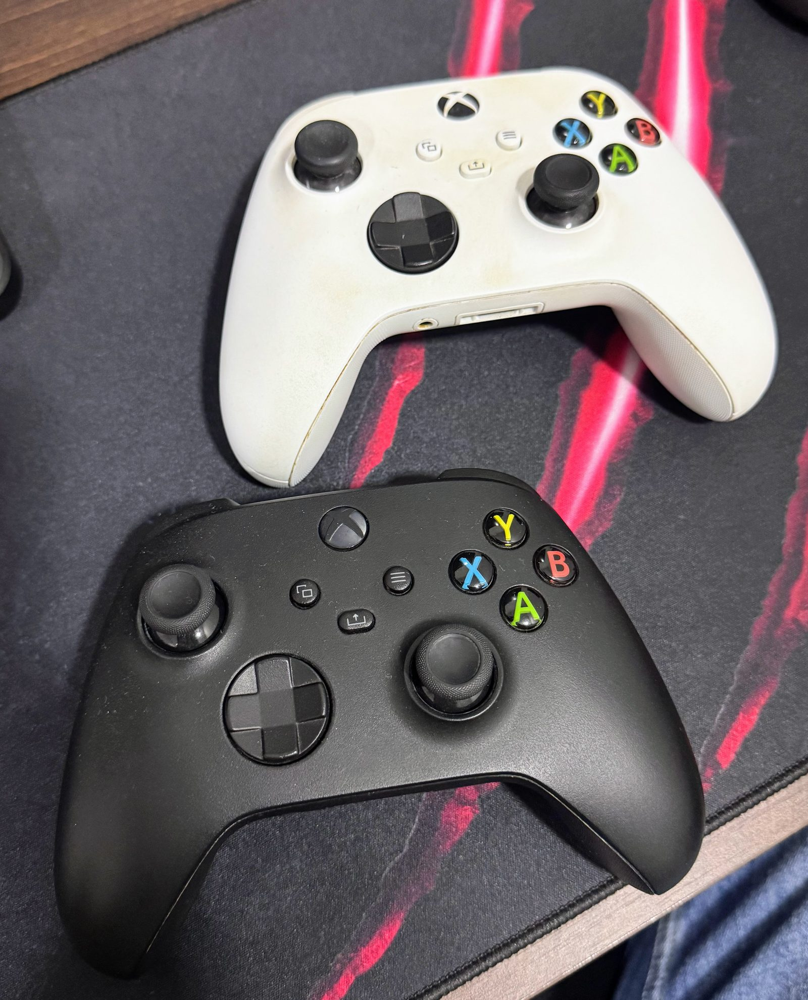

Por cabo, o controle do Xbox Series funcionava redondo no meu notebook. Plug and play, sem drama. A vontade de jogar sem fio é que começou a história.

Pareei por Bluetooth e não rolou. Fui atrás, instalei o [xpadneo](https://github.com/atar-axis/xpadneo) — o driver da comunidade pros controles Xbox no Linux — e aí ele conectou. Vibrou, inclusive, aquele rumble de boas-vindas que diz "o driver te achou". Por um segundo pareceu resolvido.

Só que o botão Xbox não parava de piscar. No painel do Bluetooth aparecia "Conectado", mas a luz piscava sem parar e, poucos segundos depois, caía. Religava o controle, tinha que apertar o botão de sync em cima pra parear de novo, conectava, piscava, caía. Um loop.

Piscar, no controle do Xbox, é ele dizendo "ainda não fechei conexão com ninguém". Ele achava que não estava conectado mesmo aparecendo como conectado. Essa contradição foi o fio da meada.

---

## As Pistas Erradas Que Pareciam Certas

O primeiro reflexo foi olhar o `dmesg`, e ali o xpadneo estava impecável:

```
xpadneo 0005:045E:0B13.0008: gamepad detected
xpadneo 0005:045E:0B13.0008: Xbox Wireless Controller connected
xpadneo rumble_welcome took 1078ms
xpadneo 0005:045E:0B13.0008: rumble streaming enabled
```

Detectou, conectou, o rumble rodou. Nenhuma linha de erro, nenhum disconnect. O driver estava fazendo o trabalho dele. O problema não era ali — o que já era uma informação: se o driver está limpo e a conexão cai, a briga é mais embaixo, no Bluetooth.

Fui pro adaptador. Um Intel 9460/9560, aquelas placas combo que juntam Wi-Fi e Bluetooth no mesmo chip. E combo card acende dois alertas clássicos que já derrubaram controle Xbox por aí:

- **Autosuspend USB** — o kernel suspende a porta do rádio Bluetooth quando ela fica ociosa, e derruba a conexão. Fui ver: estava ligado (`power/control: auto`).
- **Coexistência de 2.4 GHz** — Wi-Fi e Bluetooth dividem a antena; com o Wi-Fi em 2.4 GHz carregado, o BLE do controle sofre.

O segundo eu descartei rápido — meu Wi-Fi estava em 5 GHz (canal 36), longe da faixa do Bluetooth. O primeiro tinha cara de culpado. Desliguei o autosuspend, testei. Continuou piscando e caindo.

Aí fui no `main.conf` do BlueZ e garanti o que a documentação do xpadneo recomenda pra esses controles BLE — `ControllerMode = dual`, intervalos de conexão LE ajustados. Já estava tudo certo. E o controle continuava caindo.

Uma a uma, as suspeitas óbvias iam caindo sem resolver nada. É desconfortável, mas útil: cada pista errada eliminada é uma parte do mapa que você não precisa mais olhar.

---

## O Log Que Finalmente Falou a Verdade

A virada veio quando parei de adivinhar e fui ler o estado real do pareamento:

```
$ bluetoothctl info 14:CB:65:BF:F6:20
	Paired: yes
	Bonded: yes
	Trusted: yes
	Connected: yes
[SIGNAL] Disconnected - org.bluez.Reason.Authentication,
         Connection terminated due to authentication failure
```

Pareado, com bond, confiável — e mesmo assim **"terminated due to authentication failure"**. O controle guarda a chave de pareamento, o notebook guarda a dele, e na reconexão as duas não batem. Sem chave válida, o link não fica criptografado.

E o log do `bluetoothd` mostrava a consequência disso, repetindo a cada segundo:

```
HID Information read failed: Request attribute has encountered an unlikely error
Read Report Reference descriptor failed: ... unlikely error
```

O controle Series usa BLE, e nesse esquema os dados do controle vêm por leituras GATT que **exigem link criptografado**. Como a criptografia não se restabelecia, o controle recusava entregar os descritores HID. Por isso ele ficava "conectado" mas piscando: a conexão de rádio subia, mas o HID nunca inicializava. E o sync manual funcionava por um instante porque forçava uma criptografia nova, do zero — que na próxima reconexão já estava quebrada de novo.

Agora eu tinha o mecanismo. Faltava a causa.

---

## A Lógica Que Quase Me Fez Culpar o PC Errado

Tinha um segundo controle novo, do mesmo modelo, comprado junto com o primeiro. Peguei pra fazer o teste que parecia definitivo: se o problema é o controle, o outro funciona; se os dois falham, o problema é o notebook.



Pareei o segundo. Mesmo defeito. Piscava, conectava, caía, exigia sync a cada vez.

A conclusão saltava aos olhos: **dois controles diferentes, mesmo problema, logo a culpa é do host.** Comecei a montar o caso contra o adaptador Intel — chipset conhecido por brigar com controle Xbox, próximo passo seria um dongle USB externo.

E é exatamente aí que a dedução tinha um buraco. "Dois controles, mesmo defeito" só aponta pro host se os dois controles forem, de fato, variáveis independentes. Não eram. Comprei os dois juntos, da mesma remessa — então **os dois carregavam o mesmo firmware de fábrica.** Não eram duas amostras; eram a mesma amostra duplicada. Testar o segundo não isolou nada, só confirmou que os dois vieram com o mesmo problema embutido.

Plugei o primeiro num Windows, abri o app Xbox Accessories, e lá estava a resposta que o Linux não tinha como me dar: firmware **5.9.2709.0**, uma versão antiga com bugs conhecidos de estabilidade BLE. Mandei atualizar. Foi pra **5.23.6.0**.

De volta no Linux: removi o bond quebrado, pareei do zero. O botão parou de piscar e ficou aceso fixo. Desliguei, religuei só com o botão Xbox, sem sync — reconectou sozinho. Resolvido. A causa que eu tinha descartado com uma dedução limpa e confiante era a certa.

| O que eu suspeitei | Veredito |
|---|---|
| Driver xpadneo | Inocente — log limpo, rumble funcionando |
| Autosuspend USB | Inocente — desligar não mudou nada |
| Coexistência Wi-Fi 2.4 GHz | Inocente — Wi-Fi estava em 5 GHz |
| Config do BlueZ (`main.conf`) | Inocente — já estava correta |
| Adaptador Intel 9460/9560 | Inocente — mas eu já ia condenar |
| Firmware do controle (5.9.x) | **Culpado** |

---

## O Que Fica

O conserto foi trivial — atualizar um firmware. O que vale a pena guardar é o quase-erro no meio do caminho.

1. **"Se são dois e falham igual, o problema é o resto" só vale se os dois forem independentes.** Dois controles da mesma remessa não são duas amostras — são a mesma amostra repetida. A dedução parecia rigorosa e estava furada na premissa. Antes de confiar num teste de isolamento, pergunte se as coisas que você trocou eram mesmo diferentes no que importa.
2. **Driver limpo é diagnóstico, não frustração.** O `dmesg` sem erro não era um beco sem saída — era o sistema me dizendo "não é aqui, desce um nível". Descartar com confiança onde *não* está é meio caminho pra achar onde está.
3. **O log certo vale mais que dez tentativas no escuro.** Passei um bom tempo mexendo em autosuspend e config antes de simplesmente ler o `bluetoothctl info` e o `bluetoothd`. A palavra "authentication failure" apontou o mecanismo em dois segundos. Ler antes de mexer.

E uma última, que o próprio caso me cutucou: **talvez eu nem precisasse do xpadneo pra isso.** O travamento era 100% firmware — com o firmware novo, o controle parearia pelo driver embutido do kernel do mesmo jeito, como já fazia por cabo. O xpadneo não era o vilão nem o herói dessa história. Ele continua valendo a pena pelo que agrega — rumble nos gatilhos, mapeamento certo dos botões, nível de bateria —, mas foi bom lembrar que "instalei um driver e conectou" não prova que era o driver que faltava. Às vezes as duas coisas só aconteceram na mesma tarde.

---

*O controle chegou funcionando por cabo e teimando por Bluetooth. Passei a tarde caçando culpado no notebook até descobrir que o problema tinha vindo dentro da caixa, de fábrica, nos dois. Se o seu controle de Xbox pisca e cai no Linux, atualize o firmware antes de brigar com o BlueZ — e se você também quase condenou o inocente por uma dedução bonita demais, me chama que a gente troca figurinha.*
