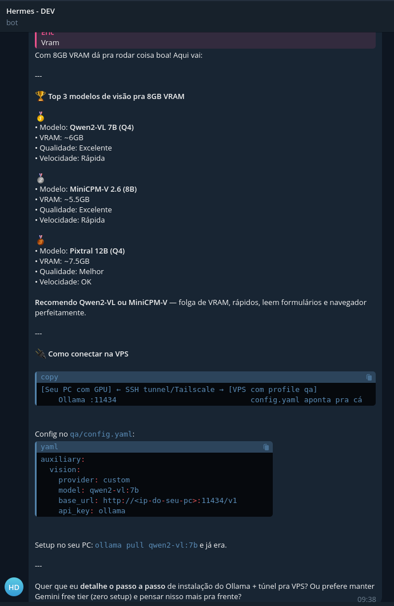
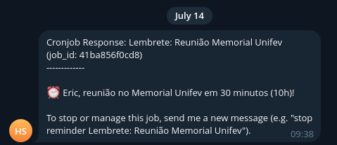
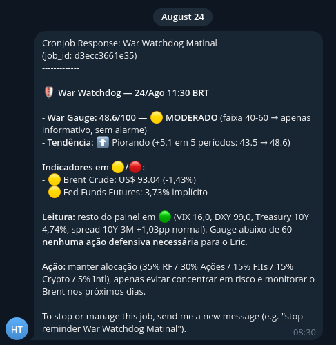
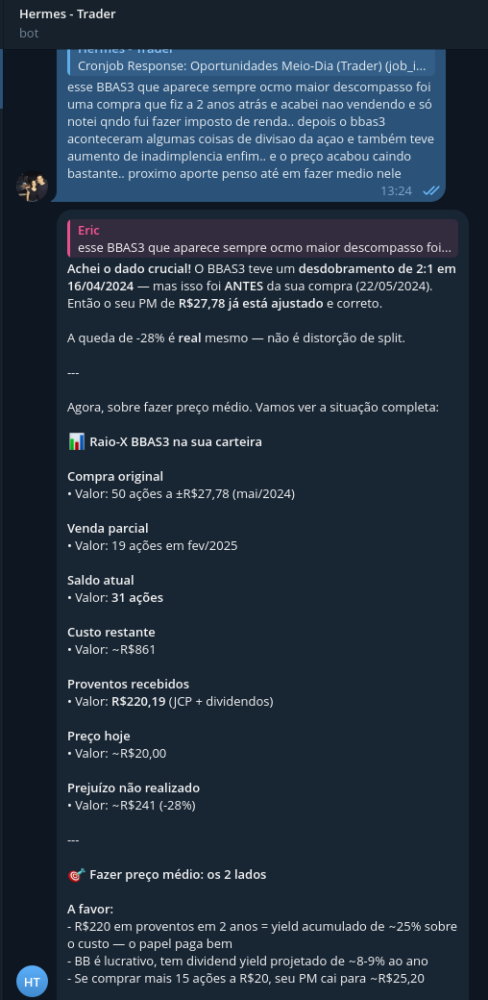

Eram 2 da manhã de uma terça-feira. Eu estava com o terminal aberto, um copo de café do lado, finalizando a configuração do quarto bot do Telegram. Quando mandei "oi" e ele respondeu, eu ri sozinho.

Não porque foi difícil — foi o oposto. O mais difícil foi decidir parar.

O que começou como "vou testar esse negócio de agente de IA" virou um ecossistema com 4 agentes autônomos rodando numa VPS de 9 dólares na Alemanha, cada um com seu bot do Telegram, sua personalidade e sua função. Um cuida do meu orçamento. Outro analisa investimentos. Um terceiro gerencia minha vida acadêmica — documentos, atas, checklist do MEC. O quarto programa sozinho.

Nenhum é um chatbot. Eles não ficam esperando eu mandar mensagem. Eles rodam 24 horas por dia, acordam com tarefas agendadas, se comunicam entre si via um quadro Kanban compartilhado, e aprendem coisas novas a cada interação.

Eu não contratei uma equipe. Eu instalei um software open source chamado Hermes Agent.

Isso foi em maio. Três meses depois, quase tudo isso está desligado — e a segunda metade deste post conta o porquê, que foi a parte que mais me ensinou. Mas primeiro o que eu montei, porque sem a subida a queda não faz sentido.

---

## Chatbot responde, agente age

Vale separar as duas coisas logo, porque a palavra "bot" mistura tudo. Um chatbot responde: você pergunta, ele devolve texto e esquece. Um agente age: lê arquivo, escreve código, consulta API, atualiza banco, agenda tarefa — e me manda mensagem quando algo importante acontece, sem eu ter perguntado nada. Quando o perfil financeiro fecha o mês, não fui eu que apertei botão nenhum: um agendamento acordou o agente, ele leu os lançamentos e o resumo chegou no meu Telegram.

Na prática, a diferença fica assim:

| Chatbot | Agente |
|---|---|
| Sessão única, sem memória entre conversas | Memória persistente em 3 camadas (sessão, usuário, skills) |
| Prompt fixo ou system prompt estático | Skills que evoluem — o agente cria e melhora as próprias instruções |
| Não executa código | Executa Python, bash, chama APIs, acessa bancos |
| Responde e esquece | Agenda, monitora, notifica proativamente |
| Um modelo, uma conversa | Orquestra múltiplos modelos e ferramentas simultaneamente |

O Hermes Agent, desenvolvido pela Nous Research, é a segunda categoria. E é open source, licença MIT.

---

## Quatro perfis, uma máquina

O que faz tudo isso caber numa VPS só é o conceito de **perfis** do Hermes. Cada perfil é um agente independente com:

- Seu próprio diretório de configuração (`~/.hermes/profiles/<nome>/`)
- Seu próprio bot do Telegram (token diferente)
- Suas próprias skills (instruções de como agir)
- Sua própria memória (SQLite + FTS5 para busca textual)
- Sua própria escolha de modelo (DeepSeek, Claude, GPT — por perfil)

Na prática, é como ter 4 computadores diferentes dentro da mesma VPS:

```
VPS (Hetzner CX32 — 4 vCPU, 8GB RAM)
├── Perfil Financeiro  → @HermesFinBot    (DeepSeek V4 Pro)
├── Perfil Trader      → @HermesTradeBot  (DeepSeek V4 Pro)
├── Perfil Coordenador → @HermesCoordBot  (DeepSeek V4 Pro)
└── Perfil Dev         → @HermesDevBot    (Claude Sonnet 4)
```

Cada perfil tem um **gateway** — um processo systemd que conecta o bot do Telegram ao modelo de IA. São 4 serviços rodando em paralelo, cada um escutando seu próprio bot:

```bash
systemctl status hermes-gateway-financeiro.service
systemctl status hermes-gateway-trader.service
systemctl status hermes-gateway-coordenador.service
systemctl status hermes-gateway-dev.service
```

---

## Skills: A Peça Que Faltava

O que separa um bot de conversa fiada de um que resolve problema de verdade são as **skills**.

Skills são arquivos Markdown com frontmatter YAML que ensinam o agente a executar tarefas específicas. Não é prompt engineering — é um sistema de arquivos que o agente consulta em tempo real.

Exemplo real, a skill MEC do perfil coordenador:

```yaml
---
name: mec
description: "Checklist e Simulação MEC/INEP — preparação para visita de avaliação externa"
metadata:
  hermes:
    tags: [academico, mec, avaliacao, inep]
---

# Checklist MEC / INEP

## Comandos Telegram
/mec — Resumo do checklist com semáforo
/mec_urgentes — Itens vermelhos
/mec_simular — Gera pergunta de avaliador
/mec_atualizar <id> <status> — Atualiza item

## Banco de dados
SQLite em ~/.hermes-ecosystem/hermes.db
Tabelas: mec_dimensions (3), mec_items (48)
```

Quando eu digito `/mec` no Telegram, o agente não está "programado" pra isso — ele **lê a skill**, entende o contexto, executa o código Python que consulta o banco, e formata a resposta com os 48 itens do instrumento INEP organizados em semáforo (verde/amarelo/vermelho).

A skill diz **o que** fazer. O código Python diz **como**. O modelo de IA decide **quando** e **por que**.

---

## Comunicação Entre Agentes: Kanban, Não Chat

Os perfis não ficam se mandando mensagem no Telegram. Isso seria caótico e frágil.

Em vez disso, eles compartilham um banco SQLite com um quadro Kanban. Quando o perfil financeiro fecha o mês e detecta R$2.000 disponíveis para investir, ele não manda mensagem pro trader. Ele cria uma **tarefa**:

```json
{
  "title": "Capital novo para investimentos",
  "assigned_to": "trader",
  "created_by": "financeiro",
  "data": {
    "amount_brl": 2000.00,
    "source": "fechamento_mensal_maio_2026"
  }
}
```

O trader, na próxima execução do cron, consulta tarefas atribuídas a ele, encontra essa, e age: distribui o capital entre as classes de ativo abaixo da alocação alvo, executa as compras de crypto (automático) e envia os sinais de ações e FIIs (semi-automático).

Isso é um sistema multi-agente real. Sem webhook, sem fila de mensageria, sem Kubernetes. SQLite e um padrão de tarefas bem definido.

---

## O Perfil Dev: Agente Que Programa

O mais ambicioso dos 4 é o perfil dev. Ele não escreve código — ele **orquestra quem escreve**.

O fluxo é um pipeline de 5 fases:

1. **Planning** — lê o CLAUDE.md do projeto, mapeia código existente, define sub-tarefas
2. **Implementation** — cria branch, abre sessão tmux, lança Claude Code, envia instruções
3. **Testing** — roda pytest e ruff, verifica regressões
4. **Review** — compila diff, revisa padrões (type hints, docstrings, secrets), notifica via Telegram
5. **Merge** — cria PR via gh CLI, squash-merge, deleta branch, atualiza a documentação

O coordenador pede "preciso de um script pra extrair dados do Censo INEP". O dev planeja, implementa, testa, revisa e entrega. Tudo que eu faço é aprovar o plano inicial e autorizar o merge.

---

## O Que Eu Aprendi Montando (e Ainda Assino)

### 1. VPS é o ambiente natural de agentes de IA

Agente desligado não serve pra nada. Uma VPS de 9 dólares resolve. Hetzner CX32, Ubuntu 24.04, 4 vCPU, 8GB RAM. Suficiente para 4 agentes rodando simultaneamente com folga.

Hardening básico: SSH com chave (nunca senha), porta não-padrão, UFW, fail2ban. Feito em 15 minutos.

### 2. DeepSeek V4 Pro foi o melhor custo-benefício pro meu caso

Para tarefas que não exigem raciocínio complexo (categorizar gastos, gerar documentos, atualizar checklist), o DeepSeek V4 Pro entrega qualidade equivalente a modelos 5x mais caros. A API é compatível com o formato OpenAI — trocar de provider é uma linha de config.

Para o perfil dev, que precisa de raciocínio de arquitetura profundo, uso Claude Sonnet 4. Cada perfil com o modelo certo para sua função.

### 3. Skills > Prompts

Gastei zero tempo fazendo prompt engineering. As skills são instruções vivas — o agente as consulta, as melhora com feedback, e cria novas quando encontra padrões repetidos.

O perfil coordenador começou com uma skill MEC. Depois de duas semanas de uso, ele mesmo sugeriu e criou skills para gerar atas de reunião e simular perguntas de avaliador.

### 4. Comece pequeno, expanda com uso real

Meu erro inicial foi querer planejar tudo antes de usar. Passei horas desenhando arquitetura no CLAUDE.md. O que realmente funcionou foi: colocar um bot no ar, usar por uma semana, e só então escrever o código de apoio para o que o bot não conseguia fazer sozinho.

O perfil financeiro operou por dias sem uma linha de código Python de backend — só a skill e o modelo. Quando precisei de categorização automática e projeção de fluxo de caixa, aí sim escrevi os módulos.

---

## Três Meses Depois: a Auditoria Que Eu Não Planejei

O plano de "o que vem por aí" era bonito: MCP, cron de fechamento mensal, trader saindo do paper trading. A realidade veio por outro caminho. A VM dos agentes rodava no meu servidor dedicado, eu precisei do espaço, e decidi migrar tudo pro Coolify. E migração tem um efeito colateral honesto: te obriga a olhar o que você realmente usa antes de carregar pro caminhão.

A auditoria doeu. Perfil por perfil:

**O dev foi o primeiro a se aposentar.** Pra programar com qualidade ele precisava do Claude — e rodar Claude por token de API, no volume que desenvolvimento pede, custa caro. Com DeepSeek ficava barato e ruim. E eu já tinha o Claude Code aberto no terminal o dia inteiro, com qualidade e custo resolvidos. O agente que programa sozinho perdeu do jeito mais prosaico possível: pela fatura.



**O coordenador nunca funcionou direito.** Os relatórios não vinham no modelo nem na qualidade que eu queria, e eu terminava montando manual. Reaproveitei o bot dele pra virar um secretário de agenda — e o secretário morreu de atrito: pra registrar qualquer coisa eu tinha que abrir o Telegram, mandar mensagem, esperar, confirmar. Hoje eu registro direto no Google Calendar, e quando planejo o dia com o Claude Code, ele já tem MCP conectado na agenda e registra sozinho. A notificação da reunião chega do mesmo jeito — sem intermediário.



**O financeiro foi o que mais lutou.** O controle desandava — saldo guardado em texto na memória do agente acumula erro, e eu vivia reconciliando na mão. Cheguei a construir um painel web próprio, com ledger de verdade, pra dar exatidão ao bot. Não bastou: painel sem Open Finance significa eu alimentando extrato pra sempre. Assinei o Organizze, que puxa os bancos sozinho. E a carteira de investimentos foi pro Status Invest, que concilia minhas ações automaticamente. Contra integração de verdade, o agente que depende de mim pra comer não tinha chance.

: saldos, vencimentos, orçamento com semáforo. Bonito de ver — mas cada número ali dependia de eu ter alimentado o ledger antes.")

**O trader foi o último guerreiro — e o que deixou a lição mais fina.** Ele tinha dois modos, e o destino de cada um resume este post inteiro.

O modo relatório: um resumo matinal diário do mercado e, quando a guerra escalou, um observatório que media o impacto dela nos preços — com direito a um "war gauge" de 0 a 100. Útil nas primeiras semanas. Mas a Bolsa não muda tanto de um dia pro outro, e o agente não tinha nada novo a dizer e dizia mesmo assim, consumindo crédito pra me repetir o ontem. Esse modo está pausado, duas semanas de teste: se voltar, volta semanal — não diário.



: panorama, radar do dia, drift por classe, dividendos. Caprichado — e mesmo assim virou ruído, porque chegava todo dia dizendo quase a mesma coisa.")

Já o modo conversa é outra história. Quando comentei com ele que pensava em fazer preço médio numa ação que vivia aparecendo como o maior descompasso da carteira, ele foi atrás do histórico e achou um desdobramento de 2:1 que eu nem lembrava, confirmou que meu preço médio já estava ajustado ("a queda de -28% é real — não é distorção de split"), montou o raio-X da posição com os proventos recebidos e me devolveu os dois lados da decisão, fechando com uma recomendação de peso moderado. Exatamente o que eu esperaria de um consultor.



Esse modo eu mantenho. O bot continua no ar, e na véspera de um aporte — ou quando quiser destrinchar uma ação — eu ainda converso com ele.

**E o de infra — um quinto perfil que nem estava no plano de maio — é o único que deixou saudade.** Ele acompanhava minhas VPSs e respondia quando eu perguntava: "como está o serviço X?" e vinha o status, na hora, no Telegram. Troquei por bots de alerta mais simples, mas alerta só me avisa — não responde pergunta. Esse talvez volte. Sozinho.


A queda ainda teve um efeito colateral que me doeu mais que os agentes: **a Aurora quebrou junto.** A Aurora — [o dashboard matinal no terminal](/posts/aurora-dashboard-matinal-terminal) — lia os dados do Hermes pra mostrar saldos e carteira. Sem o Hermes por baixo, o painel ficou cego. E foi essa perda que me mostrou o que de fato tinha valor no ecossistema inteiro: não era nenhum dos bots. Era a tela única da manhã — saldos, investimentos, avisos, agenda, notificações do GitHub, tudo num lugar só. Essa parte eu quero de volta, e reconstruir essa conciliação sem o Hermes no meio é assunto pros próximos posts.

---

## O Padrão Que Eu Só Vi na Queda

Colocando os perfis lado a lado, o padrão é constrangedor de tão claro:

1. **Morreram os que empurravam; sobreviveu o que respondia.** Relatório diário não solicitado vira ruído na segunda semana, por melhor que seja. A prova mais limpa é o trader: o mesmo agente, com o mesmo modelo e os mesmos dados, morreu no modo relatório e sobreviveu no modo conversa. E o único que eu quero de volta, o de infra, é justamente o que só falava quando perguntado. Se eu remontasse tudo hoje, essa seria a régua número um: agente bom responde mais do que empurra.
2. **Integração ganha de inteligência.** O Organizze não conversa, não raciocina, não tem personalidade — mas puxa o extrato sozinho pelo Open Finance. O Status Invest concilia a carteira sem eu mandar um print. O agente mais esperto do mundo, se depende de mim pra se alimentar, perde pro serviço "burro" que se alimenta sozinho.
3. **Agente herda a conta do modelo.** Pra tarefa simples, o modelo barato servia. Pra programar, só o modelo caro servia — e aí a ferramenta pronta que eu já pagava (Claude Code) fazia o mesmo por menos. Antes de dar um trabalho a um agente, faça a conta de qual modelo aquele trabalho exige.
4. **Agente cobra uma manutenção que não aparece em fatura nenhuma.** Eu vivia ajustando skill, corrigindo comportamento, lapidando resposta — um hobby dentro do hobby. Ferramenta pronta ninguém precisa lapidar. Quando somei o tempo que os quatro me "economizavam" com o tempo que eu gastava mantendo os quatro, a conta não fechou.

---

Em maio, eu terminava este post dizendo: alugue uma VPS, instale o Hermes Agent, crie um perfil, conecte um bot. Mantenho o roteiro — com a emenda que três meses de uso real escreveram. Comece pelo agente que **responde** algo que você pergunta com frequência, não pelo que te manda relatório. E antes de cada função, pergunte se não existe uma ferramenta especializada que já faz aquilo com integração de verdade — porque é contra ela que o seu agente vai competir, e no meu placar a especializada ganhou quase todas.

O ecossistema de maio me deixou uma lição melhor do que o próprio sistema: eu não precisava de quatro funcionários digitais. Precisava de boas ferramentas — e de um colega que atende quando eu chamo.

---

*Se esse artigo te ajudou, compartilha. Se você também montou seus agentes e eles foram morrendo um a um — ou sobreviveram, aí é que eu quero saber como — me manda mensagem que a gente troca ideia.*
