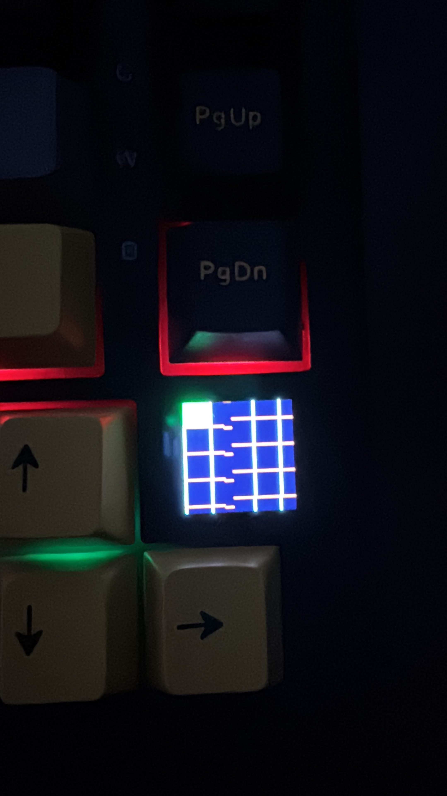
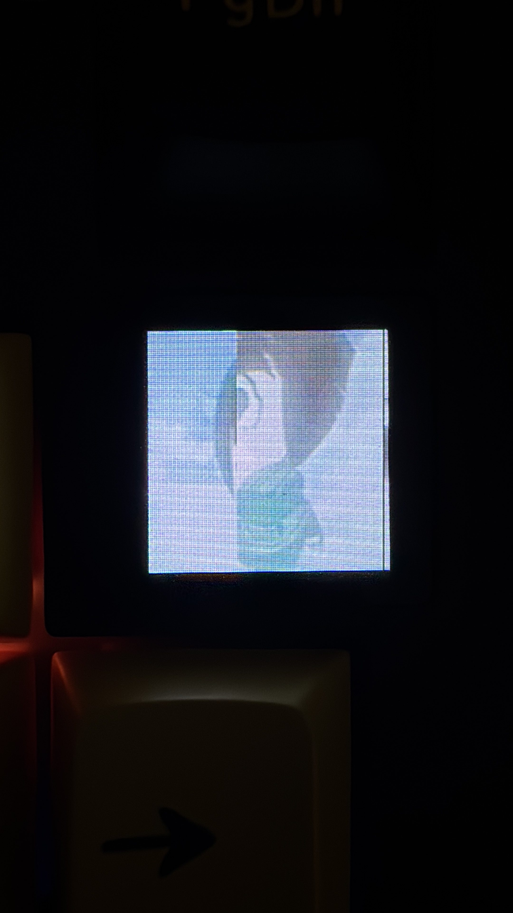

Meu teclado novo chegou hoje. Um Attack Shark X85 Pro — 75%, hot-swap, knob de alumínio e uma telinha TFT minúscula no canto. Tirei da caixa, pluguei, gostei. Switch bom, layout compacto, exatamente o que eu queria.

A primeira briga foi com o idioma. Teclado novo sempre chega com o layout brigando com o do sistema — acento no lugar errado, tecla que não responde o que está impressa. Sentei, acertei o idioma, mapeei os atalhos de multimídia (volume e play/pause direto pelas teclas de função) e o print screen. Em meia hora estava tudo redondo.

Tudo, menos uma coisa. Aquela telinha no canto, mostrando hora, bateria e modo de conexão, ficava ali me encarando. E eu encarando de volta, com a pergunta inevitável de quem gosta de mexer: o que dá pra fazer aqui?

A resposta, de cara, no Linux, foi decepcionante: nada. Atalho de tecla eu configurei. Idioma eu acertei. Print eu mapeei. Mas a telinha era território fechado — nenhuma configuração do sistema chega nela. E eu não ia me conformar com isso.

Eu só queria mexer naquela tela. Foi o suficiente pra desenrolar a história toda.

---

## O App Que Não Existe pro Linux

A telinha do X85 Pro é controlada por um "driver web" da Attack Shark. Você abre o site, ele detecta o teclado e você configura. Bonito. Só que ao abrir no meu Ubuntu, apareceu um popup pedindo pra baixar um arquivo auxiliar — o `iot_manager_rs` — com botões só pra **Windows** e **Mac**. O do Mac estava até desabilitado.

Sem esse helper, a página fica eternamente "Procurando dispositivos...". E o problema mais óbvio estava bem na minha cara: a hora na telinha estava errada, vários minutos adiantada. O relógio tem um clock interno próprio que não puxa a hora do sistema, e a única forma oficial de sincronizar é rodar o tal app — que não roda no Linux.

A saída fácil seria plugar num Windows qualquer, acertar uma vez e voltar. A configuração fica salva na memória do teclado. Cinco minutos de trabalho.

Mas eu sou teimoso, e a frase "não tem suporte pro Linux" sempre me soou mais como desafio do que como resposta. Decidi descobrir como aquela telinha conversava — e, já que ia mexer, fazer direito e abrir pra comunidade.

Spoiler: terminou o dia com um driver open source publicado no GitHub, fazendo a telinha receber a hora certa e imagens pela linha de comando. No Linux puro, sem Windows nenhum.

---

## Primeiro: Achar o Teclado

Engenharia reversa de hardware USB começa sempre no mesmo lugar — descobrir o que o sistema enxerga.

```
$ lsusb | grep -i keyboard
Bus 001 Device 005: ID 3151:5002 Gaming Keyboard
```

Fabricante `3151`, produto `5002`. O `3151` é a Yichip, fabricante do chip — o mesmo vendor aparece em outros teclados Attack Shark com tela, e isso ia ser importante depois.

Um teclado USB expõe várias interfaces HID. Uma é o teclado em si (as teclas), outra são as teclas de mídia, e em algum lugar tem o canal "vendor" — o privado, por onde o fabricante manda comandos proprietários pra telinha. Pra achar qual era, olhei os *report descriptors* de cada `/dev/hidraw`:

```
06 ff ff   Usage Page (Vendor 0xFFFF)
09 02      Usage (0x02)
a1 01      Collection (Application)
95 40        Report Count (64)
75 08        Report Size (8)
b1 02        Feature (Data,Var,Abs)
c0         End Collection
```

Esse era o canal. Usage page `0xFFFF` (vendor-defined), comunicação via **Feature reports de 64 bytes**. Era por ali que a telinha recebia ordens. No meu sistema caiu em `/dev/hidraw4`.

Pra acessar sem ser root, uma regra udev:

```
SUBSYSTEM=="hidraw", ATTRS{idVendor}=="3151", ATTRS{idProduct}=="5002", MODE="0666"
```

Um detalhe que me fez perder uns minutos: a regra só vale depois de **reconectar o cabo**. O udev só reavalia no próximo evento de "add". Recarregar as regras não basta.

Com isso, consegui abrir o canal e ler um feature report. Voltou um buffer de 64 bytes zerados — sem erro. O canal estava aberto e respondendo. Esse era o maior risco técnico, e tinha passado.

---

## A Hora Certa, de Primeira

Aqui entrou a parte de não reinventar a roda. Existe um projeto chamado [AttackManatee](https://github.com/Jinori/AttackManatee), que fez a engenharia reversa da telinha de um teclado Attack Shark parente, o K86 — mesmo vendor `3151`, mesmo esquema de feature reports de 64 bytes. Eles já tinham documentado o protocolo.

O formato do frame é simples:

```
[opcode][reservado...][checksum][payload][zero-pad até 64 bytes]
```

E o checksum é `(0xFF - (soma dos 7 primeiros bytes do header)) & 0xFF`.

O comando de relógio é o opcode `0x28`:

```
28 00 00 00 00 00 00 D7 <ano_hi> <ano_lo> <mês> <dia> <hora> <min> <seg>
```

O ano é um inteiro de 16 bits big-endian, o resto é binário puro. O `D7` é o checksum fixo desse header (`0xFF - 0x28`).

Como o meu X85 Pro era do mesmo vendor e usava o mesmo canal, a aposta era que o protocolo fosse igual. Montei o pacote com a hora atual, mandei pelo canal vendor e olhei pra telinha.

Funcionou. De primeira. A hora pulou pra certa. Uma tacada.

Foi o momento mais satisfatório do dia, e também o que enganou — me fez achar que o resto seria igual de tranquilo.

---

## O GIF Não Foi Tão Educado

Resolvida a hora, bateu a vontade de ir além: mandar imagem pra telinha. O AttackManatee também tinha mapeado isso — opcode `0xA5` pra iniciar o envio, `0x25` pra cada pedaço de pixel, frames quebrados em chunks de 56 bytes, 1158 chunks pra preencher uma tela inteira. Pixels em RGB565 big-endian, organizados em ordem column-major.

Montei a primeira imagem de teste — um círculo simples — mandei, e olhei pra tela esperando o círculo.

Veio um pedaço de círculo deslocado, com outro começando a aparecer acima. Tinha alguma coisa errada na geometria.

E aqui está a pegadinha que custou a maior parte da tarde: **o K86 e o X85 Pro têm telas de tamanhos diferentes.** O AttackManatee documentou o K86 como 240x135. O meu é uma telinha de 0.85 polegada, e a resolução exata não estava documentada em lugar nenhum. Procurei manual, review, ficha técnica. Nada. Ninguém publicou os pixels daquela tela.

Não tinha como capturar o app oficial fazendo o trabalho certo — ele não roda no Linux, lembra. Então sobrou o método mais artesanal possível: **descobrir a resolução na tentativa e erro, lendo a distorção na tela.**

---

## Calibrando uma Tela no Olho

A lógica é a seguinte. Se você manda uma imagem column-major com a altura errada, a imagem "enrola" verticalmente e vira uma escada. Quanto mais errada a altura, mais degraus. Dá pra usar a distorção como régua.

Comecei com um palpite. O buffer tinha 32.400 pixels. A raiz quadrada de 32.400 é exatamente 180 — se a tela fosse quadrada, 180x180. Mandei um padrão metade branco em cima, metade preto embaixo. Veio uma escada. Variei a altura de 1 em 1 pixel num "quente ou frio": 181 piorou, 179 deixou a divisa quase reta.



Pra confirmar, troquei pra uma grade — se as linhas verticais continuam retas, as colunas estão certas; se as horizontais inclinam, é a altura que está errada. Com 179 as horizontais ficaram retas, e ajustando a largura a grade fechou quadradinha. Mandei uma seta vermelha de teste: apareceu em pé, centralizada. Pronto, pensei. **180x179.** Anotei na tabela, atualizei o código, publiquei no GitHub.

Estava errado. E o jeito como descobri é a melhor parte da história.

### A grade mentiu

Por diversão, mandei uma imagem de verdade pra tela — um Rock Lee chibi, de Naruto. E lá estava: uma emenda no meio da imagem, a metade esquerda deslocada da direita. Uma falha gritante que a grade tinha jurado não existir.



O motivo é sutil, e me pegou feio: **padrão periódico esconde deslocamento periódico.** Uma grade com linha a cada 30 pixels parece perfeita mesmo se a imagem inteira escorregar 30 pixels — o erro "encaixa" na repetição. Eu tinha calibrado com a régua errada. Só uma imagem **assimétrica**, um rosto onde cada pixel importa, podia revelar a verdade.

Com o Rock Lee como juiz, refiz tudo. O deslocamento era um wrap horizontal: eu mandava colunas demais, as que sobravam davam a volta e sobrescreviam a esquerda. Fui reduzindo a largura até a emenda sumir — parou em **138 colunas**, não 180.

E ainda tinha um segundo andar. Com a largura certa, mandei um smiley redondo. Veio só a boca, a metade de baixo — o topo cortado. Mesma armadilha, outro eixo: a grade tinha escondido também que **a tela não mostra todas as linhas que recebe.** O framebuffer tem 180 linhas, mas só as 126 de cima aparecem no painel; o resto é buffer fora da tela (exatamente como o K86, que tinha colunas escondidas). O Rock Lee, que preenchia tudo, mascarou o corte. O smiley redondo entregou.

A geometria real da telinha do X85 Pro, depois de tudo:

| | X85 Pro | K86 |
|---|---|---|
| Framebuffer (colunas × linhas) | 138 × 180 | 240 × 135 |
| Área visível | 138 × 126 | 135 × 135 |
| Pixel | RGB565 big-endian | RGB565 big-endian |
| Ordem | column-major | column-major |

Nada disso está documentado em lugar nenhum. Descobri no olho, foto por foto — incluindo o cume falso no meio do caminho. Com a geometria certa, o smiley veio redondo e inteiro, e o Rock Lee, completo. Imagem na telinha, no Linux.

: o Rock Lee volta inteiro e reconhecível, cada pixel no lugar. Vinte fotos depois, a telinha finalmente obedece — no Linux, sem Windows nenhum.")

Tentei animação também — GIF de vários frames. Funciona, mas o firmware limpa a tela pra branco entre cada quadro, então pisca. Imagem estática fica impecável; animação fica nervosa. Fica pro próximo capítulo descobrir se o app oficial tem um truque pra isso.

---

## Transformando o Hack num Projeto de Verdade

Ter um script que funciona na minha máquina é uma coisa. Publicar pra comunidade é outra. Se eu ia colocar meu nome num repositório público, ia ser decente.

O código virou um pacote Python com uma CLI, `xshark`, usando `hidapi` pra falar com o dispositivo e Pillow pra processar as imagens. Três comandos:

```bash
xshark probe              # lista o dispositivo e o canal da tela
xshark set-time           # sincroniza o relógio com o do sistema
xshark set-gif a.png      # manda imagem (ou GIF) pra tela, com --fit opcional
xshark playlist ~/telinha # rotaciona as imagens de uma pasta
```

Pra não precisar rodar de novo a cada boot, um timer do systemd sincroniza a hora sozinho.

E aí veio a parte que separa "script que funciona" de "projeto que alguém confia em rodar":

- **Testes.** Os comandos que tocam o hardware foram validados ao vivo, mas a lógica de montar pacote e codificar pixel é função pura — então escrevi uma suíte de testes que confere os checksums, o vetor de exemplo do `set-time`, o layout dos pacotes de imagem e a conversão RGB565. Roda sem teclado nenhum plugado.
- **CI.** Um workflow que roda lint e testes a cada push, em duas versões do Python.
- **Segurança.** A superfície é baixa — sem rede, sem `subprocess`, sem `eval`, sem desserialização. O único ponto de atenção é a regra udev `0666`, que libera o dispositivo pra qualquer usuário local. Deixei documentada a variante mais restrita (`0660` com grupo `plugdev`) pra quem está num ambiente multiusuário.
- **Documentação.** Um `PROTOCOL.md` com tudo que descobri, um `CONTRIBUTING.md`, um template de issue pra galera reportar outros modelos compatíveis e um `ROADMAP.md` com o que falta.

Licença MIT, crédito explícito ao AttackManatee, que foi a base de tudo.

---

## O Que Fica

Essa foi a minha primeira contribuição open source. E o aprendizado mais forte não foi técnico — foi sobre a natureza da coisa.

Engenharia reversa parece magia quando você vê de fora. Por dentro, é o oposto de magia: é paciência metódica. Achar o canal certo. Ler um descriptor. Testar uma hipótese. Olhar o resultado. Ajustar um byte. Olhar de novo. A geometria 138x126 não saiu de uma sacada genial — saiu de umas vinte fotos seguidas comparando escadas, emendas e cortes até cada pixel cair no lugar.

Quatro coisas que levo daqui:

1. **"Não tem suporte pro Linux" quase nunca quer dizer "é impossível".** Quer dizer "ninguém com o problema sentou pra resolver ainda". O hardware fala um protocolo; protocolo se decifra.
2. **Reaproveitar trabalho dos outros é metade da batalha.** Sem o AttackManatee ter reversado o K86, eu levaria dias. Com a base deles, o relógio funcionou na primeira tentativa. A diferença foi só descobrir a geometria da minha tela específica.
3. **A régua errada mente com confiança.** Calibrei com uma grade e ela me deu uma resposta limpa, redondinha e errada — eu cheguei a publicar. Padrão periódico esconde erro periódico. A verdade só apareceu quando troquei a grade por um rosto assimétrico. Isso vale muito além de telinha de teclado: desconfie do instrumento de medida que "encaixa" certinho no resultado que você queria ver.
4. **A distância entre "funciona na minha máquina" e "alguém confia em rodar" é só disciplina.** Teste, CI, doc, nota de segurança. Não é o que faz funcionar — é o que faz durar.

O projeto está no [meu GitHub](https://github.com/EricOFreitas/attackshark-x85pro-linux). Se você tem um Attack Shark com telinha e usa Linux, roda lá e me conta se funcionou no seu modelo. E se a hora do seu teclado estiver errada agora, bom — pelo menos pra um modelo, isso já tem conserto.

---

*O teclado chegou de manhã "sem suporte pro Linux". De madrugada, a telinha que não fazia nada estava com um Rock Lee na tela, mandado pelo terminal, e a hora certa pela primeira vez. Programar é isso. Se você decifrou um hardware teimoso e quer trocar ideia, me chama.*
