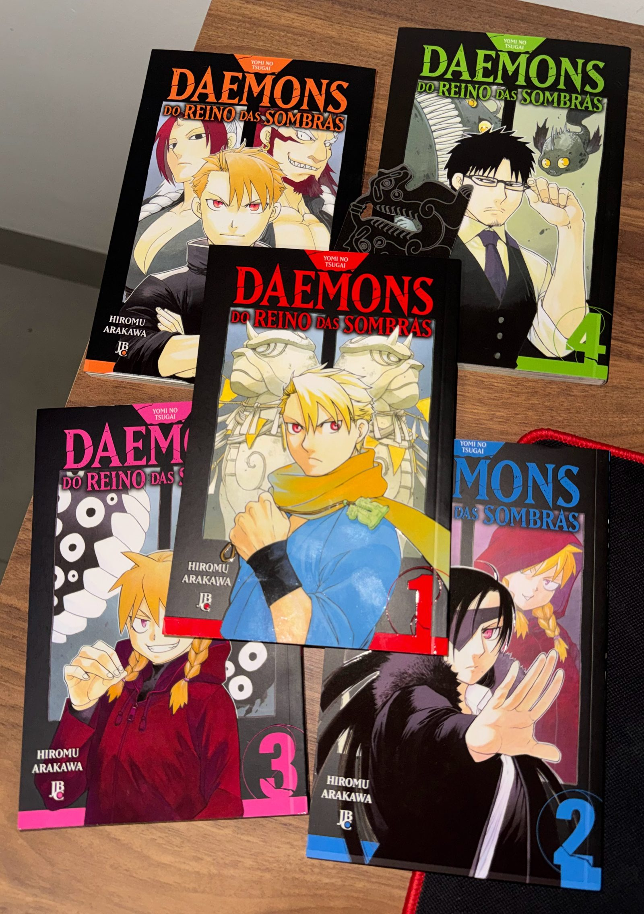
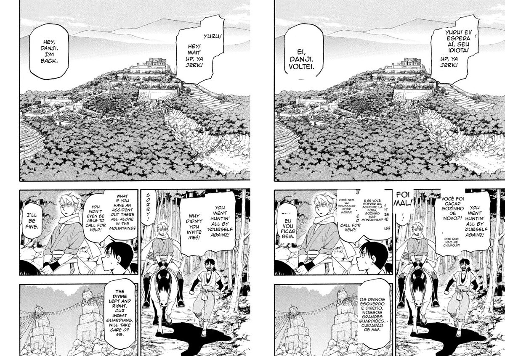
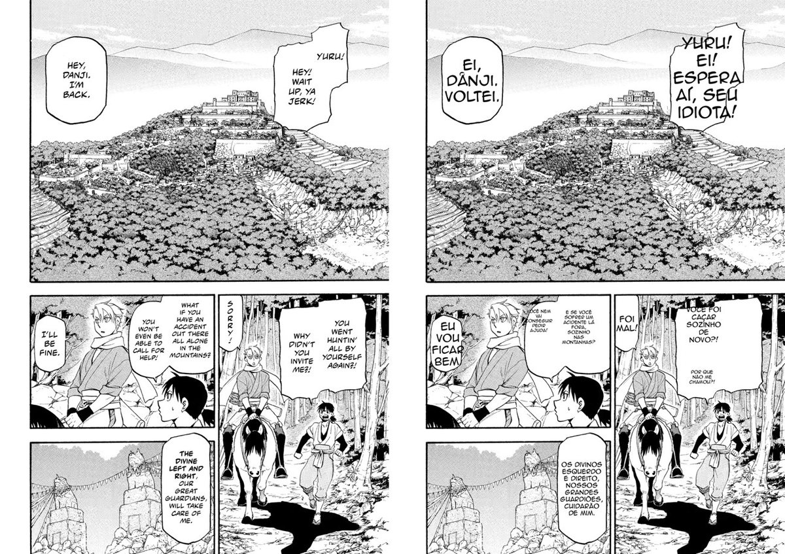
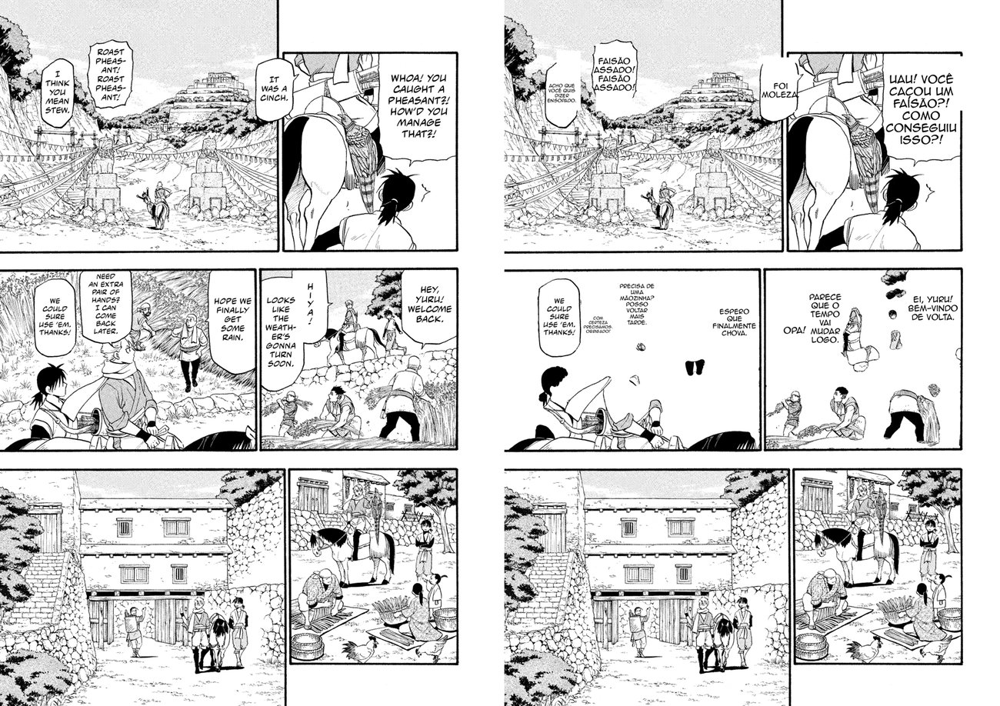

Tenho os volumes de *Daemons do Reino das Sombras* na estante — comprei porque gosto do traço da Hiromu Arakawa, a mesma de Fullmetal Alchemist. Acompanho a edição brasileira no ritmo dela: quando montei este estudo eu tinha até o volume 3 e o 4 estava saindo; só no mês que o projeto levou, entraram o 4 e o 5 na estante — e o 6 só chega mês que vem. O original está na frente disso tudo, e é aí que mora o problema: os volumes que a tradução oficial ainda não alcançou eu queria ler no meu idioma, sem depender de scan de ninguém. Tenho o material, tenho a máquina, tenho os modelos. Virou estudo: dá pra montar um tradutor que leia a página, traduza mantendo o tom e devolva a página remontada em português?

Deixo claro o enquadramento porque ele importa pro resto do texto: isso aqui é um experimento de pipeline de visão computacional rodando em cima de páginas que eu **comprei**. O que interessa — e o que eu pretendo abrir no GitHub depois — é a ferramenta, não o conteúdo. A ferramenta é agnóstica: você aponta pra sua própria pasta de imagens. As páginas deste post são das minhas cópias, e servem só pra mostrar o que o código faz.



## O problema não é o que parece

A primeira intuição de todo mundo é "ah, é só jogar a página num LLM e pedir a tradução". Não é. Quando você abre o problema, ele tem quatro partes, e só uma delas é traduzir:

1. **Ler** todo texto da página — diálogo, pensamento, narração, onomatopeia, placa.
2. **Localizar** cada bloco de texto com precisão, em coordenadas de pixel.
3. **Limpar** o texto original de dentro do balão sem comer a arte em volta.
4. **Reescrever** a tradução no lugar, com uma fonte de quadrinhos, quebrando linha e ajustando tamanho pra caber no balão.

O LLM de visão resolve os passos 1 e 4 com folga. O 2 é onde os modelos se separam. O 3 é engenharia pura, e foi o que mais me consumiu — coisa que eu não esperava quando comecei.

A arquitetura que montei é simples: mando a página inteira pra um LLM de visão e peço um JSON com uma região por balão — a caixa em coordenadas normalizadas, o tipo, o texto original e a tradução em pt-BR com instrução de manter o tom de cada personagem. O código então limpa cada balão e escreve a tradução por cima. Um cache em disco guarda o JSON de cada página, então re-renderizar (mexer em fonte, limpeza) não gasta API. Como tudo fala o protocolo da OpenAI, eu troco de modelo com uma variável de ambiente — Gemini, OpenRouter, Ollama local, tanto faz.

E foi exatamente isso que me deixou testar a hipótese mais interessante primeiro: será que roda de graça, na minha máquina?

## O modelo local que não parava de pensar

Tenho uma máquina na rede com Ollama e dois modelos de visão baixados: `qwen3-vl:4b` e `qwen3-vl:8b`. Qwen3-VL é bom. Zero custo de API, roda em casa — se funcionasse, era o cenário ideal.

Não funcionou, e o caminho até entender por quê rendeu mais aprendizado do que se tivesse dado certo de primeira.

O primeiro sintoma foi a resposta vir **vazia**. O modelo lia a página — dava pra ver no campo de raciocínio que ele tinha achado o texto — mas estourava o limite de tokens *pensando* e nunca chegava a escrever o JSON. `qwen3-vl` é um modelo "thinking", e nessa tarefa ele raciocinava sem freio: 10 mil, 15 mil, 27 mil caracteres de reflexão numa página só. Tentei desligar o pensamento por todos os parâmetros conhecidos. Nada.

Fui cavar e achei a causa raiz: o template dos dois modelos estava **quebrado**. Literalmente:

```
{{ .Prompt }}
```

Treze caracteres. O template correto do Qwen3 tem quase dois mil e é onde mora o controle de thinking — quando você pede pra não pensar, ele injeta um bloco de pensamento vazio que faz o modelo pular direto pra resposta. Sem esse template, o `think: false` não tinha onde agir. Peguei o template certo de um `qwen3:14b` que estava sadio na mesma máquina e recriei os modelos de visão com ele por cima (a visão fica nos pesos, não no template, então sobrevive à troca).

Ajudou — em pergunta simples ele passou a responder. Mas na tarefa pesada do mangá o raciocínio ainda explodia. Só quando dei 12 mil tokens de orçamento e deixei ele pensar à vontade é que saiu um JSON válido. Levou **186 segundos**. Uma página. O volume inteiro nesse ritmo passaria de dez horas.

E aí veio o golpe final, que não tinha a ver com velocidade:


A tradução do texto estava até boa. As **caixas** estavam erradas — a da narração foi parar em cima do bebê, o balão de verdade ficou intocado com o inglês dentro. Pra um pipeline que limpa e reescreve baseado nessas coordenadas, caixa errada é resultado quebrado.

Eu já tinha aprendido essa lição na marra num [estudo anterior sobre hCaptcha](/posts/benchmark-llm-visao-hcaptcha-prompt-vs-modelo): modelo pequeno é ruim de *bounding box*. Ele enxerga a cena, entende o conteúdo, mas não crava coordenada. É a fraqueza mais consistente dos modelos de visão pequenos, e ela mata exatamente o passo que o meu pipeline mais precisa que esteja certo.

Local é um laboratório excelente. Pra essa tarefa específica, é a ferramenta errada.

## O Gemini, e a surpresa dos modelos bloqueados

Fui pro Gemini. E aqui teve uma sequência de surpresas antes de qualquer tradução sair.

A primeira: pedi `gemini-2.5-flash`, que era o meu alvo por preço. Resposta: *"no longer available to new users"*. As duas variantes 2.5 estão bloqueadas pra conta nova. Caí no alias `gemini-flash-latest`, que resolve pra `gemini-3.5-flash` — e aí bati na parede do tier gratuito: **20 requisições por dia, por modelo**. Não dá volume nenhum com isso.

O detalhe que me destravou: o limite é *por modelo*. O que tinha esgotado era o 3.5-flash. O `gemini-flash-lite-latest` — que resolve pra `gemini-3.1-flash-lite` — tinha cota própria, intacta. Testei com ele. Funcionou de primeira, e a qualidade me surpreendeu.

Antes de rodar o volume, fiz a pergunta óbvia: vale pagar pelo modelo maior? Traduzi a mesma página no flash-lite (o barato) e no 3.5-flash (seis vezes mais caro) e comparei:

| trecho original | flash-lite (3.1) | flash (3.5) |
|---|---|---|
| IT WAS A CINCH | "Foi moleza." | "Foi moleza." |
| HOPE WE FINALLY GET SOME RAIN | "Espero que finalmente chova." | "Espero que finalmente venha uma chuva." |
| I THINK YOU MEAN STEW | "Acho que você quis dizer ensopado." | "Acho que quer dizer ensopado." |

Empate técnico — e em dois dos três casos o modelo **barato** ficou mais natural. Pra tradução, o flash-lite entregava o mesmo nível por um sexto do custo. Decisão fácil. O modelo caro não comprava qualidade nenhuma aqui.

A tradução, aliás, é a parte que menos deu trabalho. O modelo pega o registro coloquial sem esforço: "SORRY!" virou "Foi mal!", "ya jerk" virou "seu idiota", "we're in for bad weather" virou "o tempo vai virar". Um glossário acumulado entre páginas mantém nomes e termos coerentes ao longo do volume. Se o problema fosse só traduzir, o post acabava aqui.

## A parte difícil de verdade: limpar o balão

O Gemini acerta as caixas muito melhor que o modelo local. Mas "melhor" não é "pixel-perfeito", e no passo de limpeza essa diferença aparece feia.

Minha primeira versão da limpeza preenchia um retângulo em volta do texto. O problema:



Caixa um pouco menor que o balão, e sobra inglês nas beiradas. A solução foi parar de confiar na caixa do modelo pra limpar e passar a **detectar o balão de verdade** com visão computacional clássica: a partir do centro da caixa, um flood-fill acha a região branca fechada do balão (limitada pela borda preta), fecha os buracos do texto e me dá a máscara do balão inteiro. Limpo o balão completo, não um retângulo torto.

Isso criou um segundo problema, mais sutil. Mangá adora **balões conjugados** — dois balões colados. O flood-fill de um vazava pro vizinho, os dois recebiam a mesma máscara, e as duas traduções eram escritas no mesmo lugar, uma por cima da outra. Virou sopa de letra.

A saída foi separar as duas responsabilidades: **apagar** pode usar a máscara grande do balão (limpa bem), mas **escrever** cada tradução na sua própria caixa detectada. Assim, mesmo quando a limpeza abrange dois balões juntos, cada texto fica no seu canto:



Ainda teve o caso dos balões pontudos de narração, aqueles estilo explosão, onde as pontas irregulares escapavam do flood-fill e deixavam fragmentos ("BORN..." virando um "BOO" solto). Resolvi reforçando: além da máscara, apago também a caixa de texto do modelo. Cinto e suspensório.

Nenhuma dessas três correções tem a ver com IA. É tudo OpenCV e geometria — a parte "chata" que separa um experimento de um resultado que dá pra ler.

## Onomatopeia: legendar ou não

As onomatopeias desenhadas — aquele "WAAAH" que faz parte da arte — são um caso à parte. Apagar significaria destruir o desenho. Deixei duas opções no código:

 polui páginas cheias de ação. Deixar a arte intacta (direita) é a convenção da maioria das scanlations — e ficou mais limpo. É uma flag no comando.")

Numa página cheia de ação, legendar cada "BUÁÁÁ" polui tudo. Deixar a arte intacta, como a maioria das scanlations faz, fica mais limpo. Virou uma flag: `--sfx skip` ou `--sfx caption`. Rodei o volume sem legenda.

## Rodar o volume e os dois erros que quase passaram

Com os três passos resolvidos, soltei o volume inteiro: 197 páginas. Terminou em uns quinze minutos e custou **quarenta centavos de dólar**. Duas páginas, porém, estouraram na renderização — e os erros são engraçados de tão específicos.

A primeira: `y1 must be greater than or equal to y0`. O modelo tinha devolvido uma caixa com o `ymax` menor que o `ymin` — coordenadas invertidas. A segunda: `not enough values to unpack (expected 4, got 1)`. Nessa página, o modelo embrulhou **cada caixa numa lista extra** — `[[y, x, y, x]]` em vez de `[y, x, y, x]`.

São os dois jeitos clássicos de um LLM entregar JSON quase certo. A correção foi defensiva: uma função que desembrulha o aninhamento duplo, ordena as coordenadas pra garantir que `min < max`, valida que tem quatro números e descarta o que for irrecuperável — sem derrubar a página inteira por causa de uma região torta. Como o cache guarda o resultado por página, reprocessar essas duas foi instantâneo. E, por garantia, re-traduzi as duas do zero: numa chamada nova o modelo devolveu as caixas limpas, e as páginas fecharam certas.



## A conta

Tudo somado, o volume inteiro no `gemini-3.1-flash-lite`:

| item | valor |
|---|---|
| páginas | 197 |
| tokens de entrada | ~627 mil |
| tokens de saída | ~159 mil |
| custo total | ~US$ 0,40 |
| tempo | ~15 min |

Quarenta centavos e um quarto de hora pra um volume que eu leria em uma sentada. O modelo local, que era de graça, teria levado mais de dez horas e entregado caixas que eu teria que consertar na mão página por página.

## O que eu levo desse estudo

Comecei achando que o trabalho seria ensinar a IA a traduzir mangá. Errei o alvo. Traduzir foi a parte fácil — qualquer modelo de visão decente pega o tom e a gíria. O trabalho de verdade estava em três lugares que eu subestimei:

1. **Bounding box é o que separa os modelos.** Não é "quem traduz melhor", é "quem crava a coordenada". Modelo local pequeno não crava — mesma lição que o hCaptcha já tinha me dado. Se o seu pipeline depende de onde o texto está, teste isso *primeiro*, antes de se apaixonar pela qualidade da tradução.

2. **A limpeza é engenharia clássica, não IA.** As três correções que fizeram o resultado ficar legível — máscara de balão, escrever por caixa própria, reforço nas pontas — são OpenCV e geometria. O LLM não ia resolver isso; era eu que precisava resolver em volta dele.

3. **O modelo caro não comprou nada aqui.** Antes de rodar 197 páginas no tier de cima, uma comparação de uma página mostrou que o barato empatava — e às vezes ganhava. Meia dúzia de chamadas de teste economizaram a decisão errada.

O próximo passo é limpar o código e abrir no GitHub. A ferramenta não tem nada de específico do meu volume: você aponta pra sua própria pasta, escolhe o modelo, e ela traduz. O valor está no pipeline — na detecção de balão, na limpeza ciente de conjugados, no cache que deixa você iterar de graça — não nas páginas. Essas são minhas, estão na estante, e só apareceram aqui pra mostrar o que quarenta centavos de IA de visão bem orquestrada conseguem fazer.
